- [About](#about)
- [Features](#features)
- [Entity Relationship Diagram](#entity-relationship-diagram)
- [Use It Locally](#use-it-locally)
  - [Detailed steps on how to run the project in Linux](#detailed-steps-on-how-to-run-the-project-in-linux)
  - [Detailed steps on how to run the project in Windows](#detailed-steps-on-how-to-run-the-project-in-windows)
- [Screenshots](#screenshots)
  
# About

I built this website in 2019 for my "bachelor's degree final project".

This website is created using the LAMP stack. It is dedicated to students and professors at Moroccan universities, and, it contains two main parts: a _**Classroom**_ and a _**Forum**_.


# Features

Students and professors can create accounts, login, and logout

-   The **Classroom**'s features:
    -   Students and professors must choose their universities
    -   Professors can create classes (small rooms) in their universities, where they will be posting/uploading documents for courses, home works, etc
    -   Students can subscribe to classes and start seing posts
    -   Students can download the class material (for ex the PDF documents)
    -   Students can discuss a class's post through comments
-   The **Forum**'s features:
    -   This is a question-and-answer based forum
    -   Users (both students and professors) can create/search/follow topics they are interested in
    -   Users can ask questions about a topic and answer questions
    -   Each user will have a profil, so users can track each other (How many topics a user follows? Which questions they asked? What answres they gave? etc)


# Entity Relationship Diagram

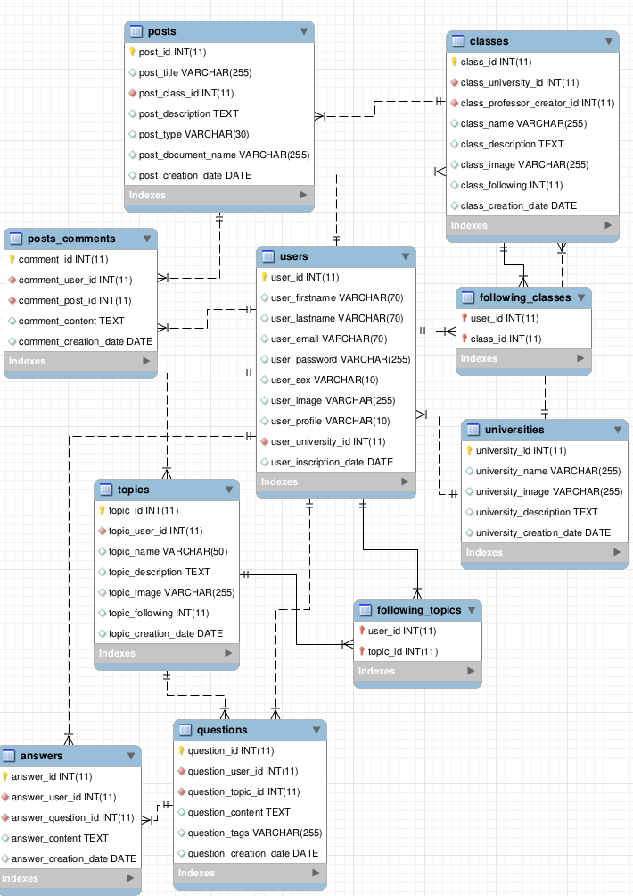


# Use It Locally

## Detailed steps on how to run the project in Linux

* Download XAMPP for Linux from https://www.apachefriends.org/fr/download.html
* Open the terminal and go to Downloads folder and run (installer execution permission) 
    ```bash
    sudo chmod +x xampp-linux-x64-8.0.9-0-installer.run
    ```
* Run the installer via
    ```bash
    sudo ./xampp-linux-x64-8.0.9-0-installer.run 
    ```
* Start Apache & MySQL servers using:
    ```bash
    sudo /opt/lampp/lampp start 
    ```
* Clone the project to your filesystem
* Unizp the project's folder under /opt/lampp/htdocs/project
* Open http://localhost:80/phpmyadmin
* Create a database named **project**
* Import *project.sql* file into it
* Go to http://localhost:80/project
* You can log in to the website with a bunch of existing accounts (email/password):
    * alae@gmail.com / alae
    * anas@yahoo.fr / anas
    * hamza.jeb@gamil.com / hamza
    * farid.qbch@gmail.com / farid

## Detailed steps on how to run the project in Windows

* Download XAMPP for Windows from https://www.apachefriends.org/download.html
* Run the .exe and follow the wizard steps to install it (choose C:\xampp as the installation destination folder)
* run 
    ```bash
    C:\xampp\xampp-control.exe
    ``` 
    A wizard will appear. Start Apache & MySQL servers
* Clone the project to your filesystem
* Unizp the project's folder under C:\xampp\htdocs\project
* *THE REST OF THE STEPS ARE THE SAME*


# Screenshots

Website's home page
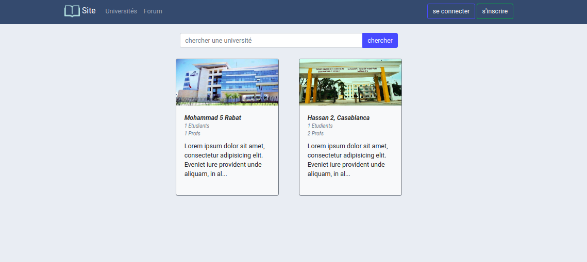

University's profile
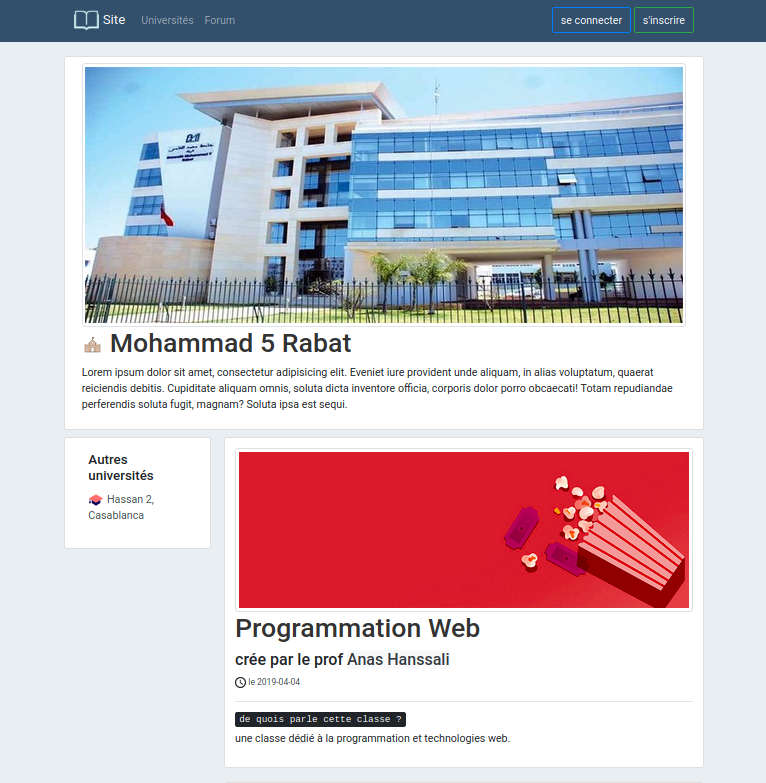

Class's profile
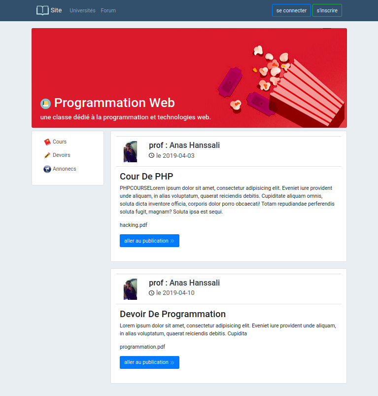

Class post's profile
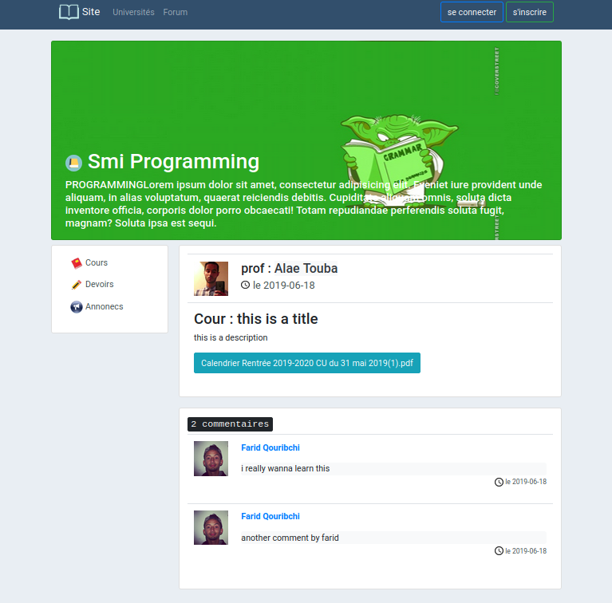

PDF document to read online or download
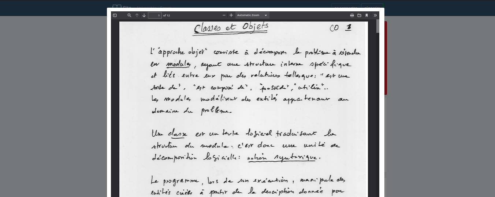

Login and registration forms
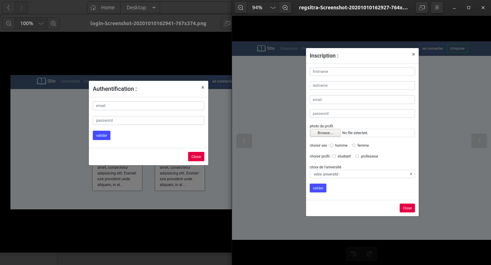

Forum's home page
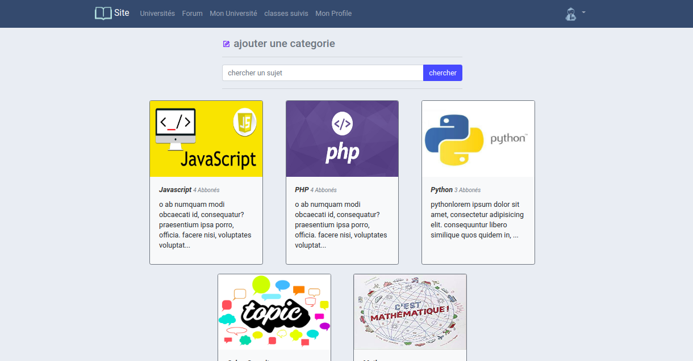

Topic's profile
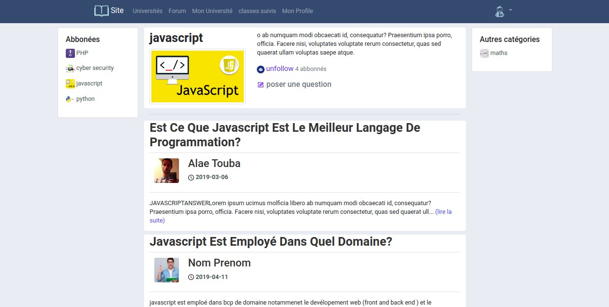

Question's profile
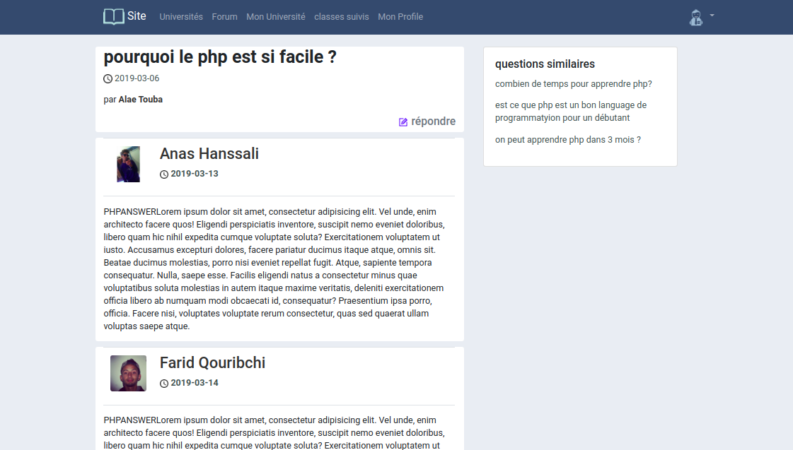

User's profile
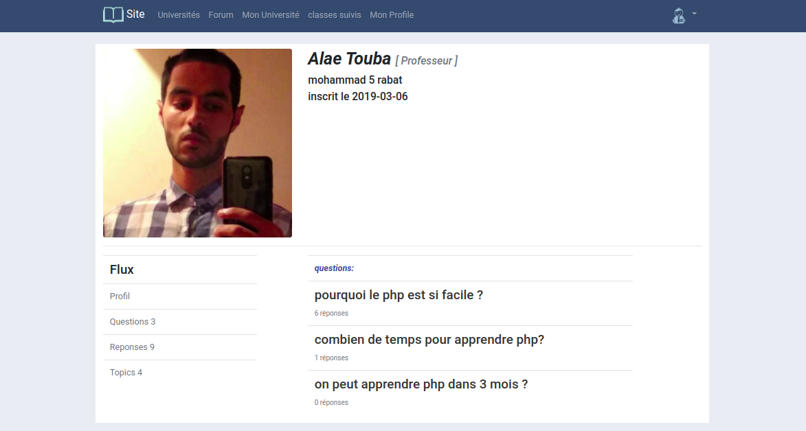
